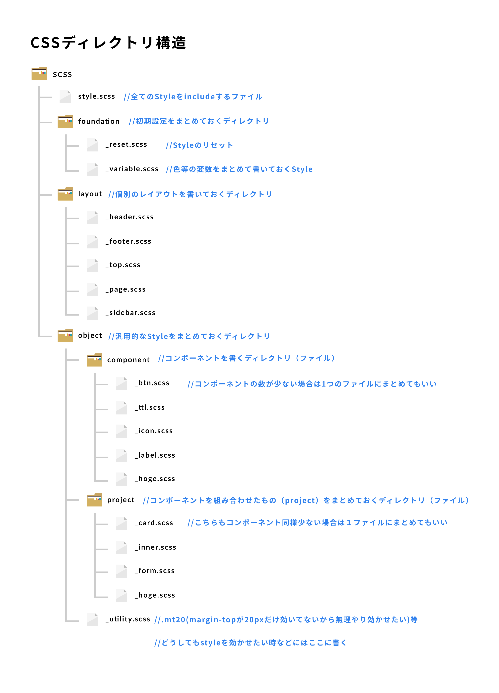

# CSSコーディングガイドライン
CSSのコーディングガイドラインです

## ディレクトリ構成

### Figma
https://www.figma.com/file/FW8FQkGG3uxgXIGemtOO0llp/CSS-directory-structure-diagram/duplicate

# CSS命名規則
## BEMとOOCSSとFLOCSSを組み合わせて命名する

### そもそもOOCSSとは？
- https://hajipion.com/1879.html
- 構造とみためを切り離す

### そもそもBEMとは？
- https://ferret-plus.com/7808
- .inner__itemみたいに上の要素を継承して命名する

### そもそもFLOCSSとは？
- https://qiita.com/sueshin/items/dcbaf3d8a0adb6b087db
- ファイル名に相当するプレフィックスがつく

## 上記を踏まえた上での命名規則

### 例　こんな感じの構造だった場合
<pre class="line-numbers"><code class="language-markup">&lt;div class=&quot;container&quot;&gt;
    &lt;div class=&quot;container__inner&quot;&gt;
          &lt;ul class=&quot;container__inner__nav&quot;&gt;
                &lt;a href=&quot;#&quot; class=&quot;inner__nav__item&quot;&gt;
                    &lt;li class=&quot;c-btn c-btn1 c-btn1--active&quot;&gt;hogehoge&lt;/li&gt;
                &lt;/a&gt;
                &lt;a href=&quot;#&quot; class=&quot;inner__nav__item&quot;&gt;
                    &lt;li class=&quot;c-btn c-btn1&quot;&gt;hogehoge&lt;/li&gt;
                &lt;/a&gt;
                &lt;a href=&quot;#&quot; class=&quot;inner__nav__item&quot;&gt;
                    &lt;li class=&quot;c-btn c-btn1&quot;&gt;hogehoge&lt;/li&gt;
                &lt;/a&gt;
          &lt;/ul&gt;
    &lt;/div&gt;
&lt;/div&gt;
</code></pre>
- コンポーネントを作る際など、構造と見た目を切り離してコーディングする
#### component.scss
<pre class="line-numbers"><code class="language-css">//ボタンで使う共通のスタイル
.c-btn {
    width:120px;
    height:40px;
    font-size:16px;
    font-weight:bold;
    text-align:center;
    line-height:40px;
    border-radius:8px;
    border-style:solid;
    border-width:2px;
}
//個別のスタイル
.c-btn1 {
    background-color:blue;
    border-color:#ccc;
    color:#123456;
    &--active {
        opacity:0.6;
    }
}
//個別のスタイル
.c-btn2 {
    background-color:red;
    background-color:#bbb;
    color:#234567;
}
</code></pre>
- BEMではハイフン（-）とアンダーバー（_）は２文字づつ使用する
    - `.container__inner`
- BEMのBlock（親要素）の継承は２つ上まで記載する
<pre class="line-numbers"><code class="language-css">.container {
    width:960px;
    margin:0 auto;
    &&#x5F;&#x5F;inner {   (.container&#x5F;&#x5F;inner)
        background-color:#eee;
        &&#x5F;&#x5F;nav {   (.container&#x5F;&#x5F;inner&#x5F;&#x5F;nav)
            background-color:#ccc;
            padding:5px;
            display:flex;
            justfy-content:flex-start;
            .inner&#x5F;&#x5F;nav&#x5F;&#x5F;item {   (下の要素になったら、直近の２要素を継承する)
                color:#fff;
            }
        }
    }
}
</code></pre>
- （特にコンポーネントなど）プレフィックスをつけてわかりやすくする
    - `.c-btn` `.p-card`
- 2語以上で命名したい際はスネークケースを使用する（ハイフン使用-）
    - `.main-visual`
