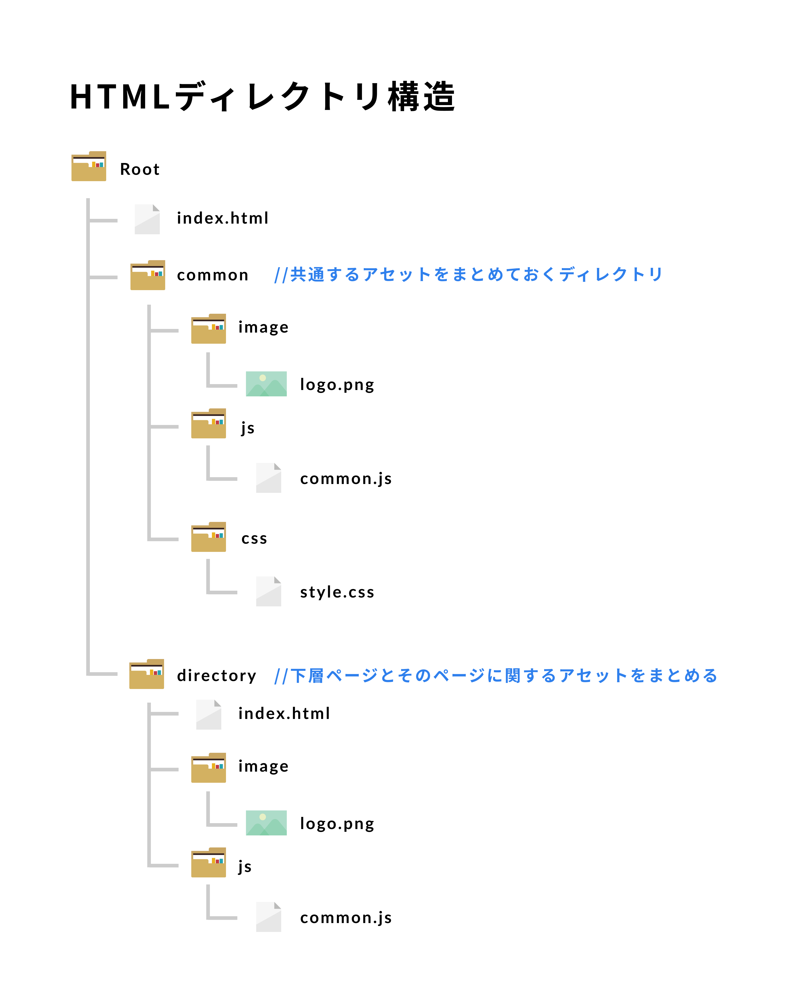

# コーディングガイドライン
# シンタックス
- インデントはスペース2つで
    - 全ての環境で同じようにコードをrenderさせる
- 階層が違う場合はインデントする
- 属性にはダブルクオーテーションを使用
- 空要素には `/` を入れない
- 閉じタグは任意でも必ず記入する

```
<!DOCTYPE html>
  <html>
    <head>
      <title>Page title</title>
    </head>
    <body>
      
      <h1 class="hello-world">Hello, world!</h1>
    </body>
</html>
```

# 必要のないスペース
エディタで消すように設定する

# DOCTYPE宣言
下記のように記述する
```
<!DOCTYPE html>
<html>
  <head>
  </head>
</html>
```

# Language属性
lang="ja"を設定する
```
<html lang="ja">
  <!-- ... -->
</html>
```
# IE compantibility mode
edge modeでrenderするように設定
```
<meta http-equiv="X-UA-Compatible" content="IE=Edge">
```

# headの中身

- charsetを一番最初に記述する

```
  <meta charset="utf-8">
  <meta http-equiv="x-ua-compatible" content="ie=edge">
  <title></title>
  <meta name="description" content="">
  <meta name="viewport" content="width=device-width, initial-scale=1, shrink-to-fit=no">

  <link rel="manifest" href="site.webmanifest">
  <link rel="apple-touch-icon" href="icon.png">
  <!-- Place favicon.ico in the root directory -->

  <link rel="stylesheet" href="css/normalize.css">
  <link rel="stylesheet" href="css/main.css">

  <!-- OGPの必須プロパティ -->
  <meta property="og:title" content="ページのタイトル" />
  <meta property="og:type" content="article" /> <!--またはwebsite, blog-->
  <meta property="og:url" content="ページのURL" />
  <meta property="og:image" content="画像のURL" />

  <!-- OGPのオプションプロパティ -->
  <meta property="og:site_name" content="サイト名" />
  <meta property="og:description" content="ページのディスクリプション" />

  <!-- Facebook専用のプロパティ -->
  <meta property="fb:app_id" content="App-ID（15文字の半角数字）" />

  <!-- Twitter Cardsの記述 -->
  <meta name="twitter:card" content="summary">
  <meta name="twitter:site" content="@[Twitter ID]">
```


# 文字エンコード
基本UTF-8に設定する
```
<head>
  <meta charset="UTF-8">
</head>
```

# CSS と JSの読み込み
`type` 属性は必要ないので、書かない。
CSS と JavaScript のファイルは `text/css` と `text/javascript` として読みこむ
```
<!-- CSS -->
<link rel="stylesheet" href="code-guide.css">

<!-- JavaScript -->
<script src="code-guide.js"></script>
```

# 属性の順番
属性は読みやすいように以下順番で表記する

<ul>
  <li><code>class</code>,<code>id</code></li>
  <li><code>data-*</code>,<code>name</code>,<code>src</code>, <code>for</code>, <code>type</code>, <code>href</code>, <code>value</code>,<code>title</code>, <code>alt</code>,<code>role</code>, <code>aria-*</code></li>
</ul>


# ブーリアン属性
`disabled` や `checked` などのブーリアン属性には `value` を追加しない
```
<input type="text" disabled>

<input type="checkbox" value="1" checked>

<select>
  <option value="1" selected>1</option>
</select>
```

# マークアップはなるべく簡潔に
必要ない要素は取り除き、なるべくマークアップを簡潔にまとめる
```
<!-- 避ける -->
<span class="avatar">
  
</span>

<!-- こちらがOK -->

```

# HTMLディレクトリ構造



※ただし２ページ以下の場合はrootに下層ページをおいても問題ないものとする
※HTMLディレクトリ構造を変更する場合は下記Figmaより変更する
https://www.figma.com/file/zowxzbuF5uuYi1g0kRbh0l/directory-structure-diagram/duplicatehtml
